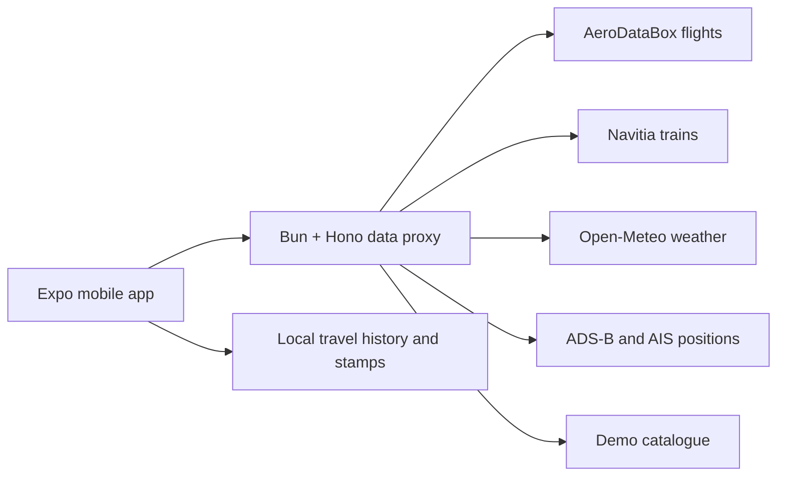

# Architecture

La cible mobile Sui et son parcours de protection en USDC sont détaillés dans la [spécification d'abstraction de compte](./mobile-sui-account-abstraction-spec.md).

`packages/shared` defines the travel models and provider adapters used by both app and proxy. The app tracks legs, shows maps and weather, records status changes, and produces local notifications. The proxy keeps provider credentials outside the app, applies cache and rate limits, and returns normalised responses.

The passport reads completed legs from the local trip store and renders shareable visual stamps. It makes no external verification claim.
