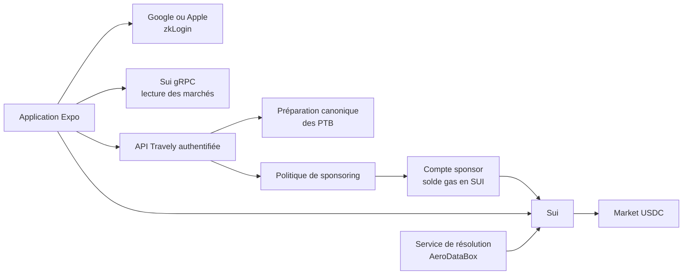

# Travely Mobile — Protection contre les retards sur Sui

Statut : spécification produit et technique

Date : 27 septembre 2026

## 1. Résumé

Travely permet à un voyageur d'acheter une protection contre le retard de son vol depuis l'application mobile. La protection est représentée par une position sur un marché binaire Sui. Le voyageur choisit un seuil de 30 minutes, 1 heure, 2 heures, 4 heures ou 6 heures et plus.

L'utilisateur se connecte avec Google ou Apple, paie sa position en USDC et ne manipule ni seed phrase, ni clé privée, ni SUI. Travely sponsorise les frais réseau et limite strictement ce sponsoring aux opérations autorisées du contrat.

Le MVP se concentre sur une protection par vol. Les vaults par compagnie, route ou catégorie de vol restent une extension ultérieure, après validation de l'usage principal.

## 2. Décisions de produit

- Le compte Sui conserve l'adresse zkLogin dérivée directement du fournisseur OAuth et du salt. La récupération de cette adresse dépend de l'accès au même compte Google ou Apple et de la stabilité du salt.
- Les mises, la liquidité et les versements utilisent l'USDC natif sur Sui.
- L'utilisateur n'a pas besoin de posséder du SUI.
- Travely paie le gas réseau en SUI via un compte sponsor backend.
- Travely prélève 1 % de la prime à l'achat et 0,5 % du versement brut gagnant au règlement.
- L'achat est exécuté dans un seul Programmable Transaction Block.
- Le backend ne sponsorise que les fonctions et les objets explicitement autorisés.
- Le règlement du vol reste assuré par un service séparé disposant du `ResolverCap`.
- Le MVP propose un versement en un clic après résolution. Un versement automatique sans nouvelle signature demanderait une délégation onchain supplémentaire.

### Présentation des frais

Le protocole Sui facture toujours le gas en SUI pour les appels `market::buy` et `market::claim`. Travely règle ce SUI en arrière-plan avec Enoki. Les frais Travely sont des frais de service en USDC ; ils ne sont jamais présentés comme du « gas en USDC ».

## 3. Objectifs

### Objectifs utilisateur

- Créer un compte sans installer de wallet ni sauvegarder de seed phrase.
- Voir tous les montants en USDC.
- Acheter une protection avec une seule confirmation.
- Ne jamais devoir acquérir du SUI.
- Comprendre la condition de versement, le montant engagé et le versement potentiel avant de confirmer.
- Recevoir le versement en USDC après la résolution du vol.

### Objectifs techniques

- Séparer l'identité utilisateur, le sponsoring et la résolution des vols.
- Faire signer à l'utilisateur les octets exacts de la transaction exécutée.
- Empêcher le sponsor de financer un appel arbitraire, un faux token ou un montant hors limites.
- Garder les positions sous le contrôle de l'adresse Sui de l'utilisateur.
- Permettre une configuration distincte pour le testnet et le mainnet.

## 4. Hors périmètre du MVP

- Vaults multi-vols et allocation automatique de capital.
- Marché secondaire des positions.
- Dépôt ou retrait de liquidité depuis l'application voyageur.
- Fonctions de résolution ou d'administration dans l'application voyageur.
- Lancement mainnet et argent réel.
- Promesse de versement automatique sans action de l'utilisateur.
- Couverture de plusieurs conditions de retard dans une même position.

## 5. Parcours mobile

### 5.1 Création du compte

1. L'utilisateur choisit « Continuer avec Apple » ou « Continuer avec Google ».
2. L'application démarre une session zkLogin avec une clé éphémère.
3. Le backend fournit ou retrouve le salt déterministe associé au compte.
4. L'application obtient la preuve zkLogin et dérive la même adresse Sui à chaque connexion avec le même fournisseur OAuth et le même salt.
5. La clé de session zkLogin est conservée avec les mécanismes sécurisés de la plateforme. Aucun secret durable n'est exposé dans `EXPO_PUBLIC_*`.
6. L'utilisateur arrive dans Travely sans écran de wallet obligatoire.

L'adresse Sui reste consultable dans les paramètres pour la transparence et le support.

### 5.2 Solde et approvisionnement en USDC

Le Profil contient une page « Solde et recharge USDC ». Elle affiche le solde de l'adresse zkLogin, permet de copier cette adresse, ouvre le faucet officiel Circle et explique comment sélectionner USDC puis Sui Testnet. Le faucet fournit 20 USDC de test par demande, dans la limite publiée par Circle. Un bouton actualise le solde au retour dans l'application.

Le testnet utilise exclusivement l'USDC natif Circle. Aucun `MockUSDC` et aucun type de coin saisi par l'utilisateur ne sont acceptés.

Le type de coin est fourni par la configuration backend. Il ne doit jamais être saisi ou choisi par l'utilisateur.

### 5.3 Achat d'une protection

1. L'utilisateur ouvre un vol éligible.
2. Travely affiche la condition exacte, par exemple « arrivée avec au moins 30 minutes de retard ».
3. L'utilisateur choisit le montant de sa position en USDC.
4. L'application affiche :
   - le prix estimé ;
   - le versement potentiel ;
   - les frais Travely de 1 % sur la prime ;
   - le montant total débité ;
   - l'heure de fermeture du marché ;
   - la source utilisée pour résoudre le retard.
5. Le backend prépare une transaction canonique avec une expiration courte.
6. L'utilisateur confirme et signe les octets exacts de la transaction.
7. Le backend valide la transaction, la cosigne comme sponsor et l'exécute.
8. L'application affiche le reçu et le digest Sui.

Le PTB réalise atomiquement :

1. la sélection du solde USDC de l'utilisateur ;
2. l'appel `market::buy<USDC>` ;
3. l'isolation des frais Travely en USDC dans le contrat ;
4. la création de la position détenue par l'utilisateur.

Si une étape échoue, aucun débit partiel ne doit subsister.

### 5.4 Résolution et versement

1. Le service de résolution récupère l'heure d'arrivée réelle auprès du fournisseur de données de vol.
2. Il soumet `resolve_arrival<USDC>` avec le `ResolverCap` associé au marché.
3. L'application détecte le résultat et indique si la position est gagnante.
4. L'utilisateur choisit « Recevoir mon versement ».
5. Travely prépare et sponsorise `claim<USDC>`.
6. Le contrat prélève 0,5 % du versement brut gagnant, verse le solde net en USDC à l'adresse de l'utilisateur et détruit la position consommée.

Le bouton de versement n'est présenté que si la position est réclamable.

### 5.5 Parcours d'échec requis

- L'utilisateur annule la connexion ou la signature.
- Le solde USDC est insuffisant.
- Le prix a changé entre la préparation et l'exécution.
- Le marché est fermé ou déjà résolu.
- Le sponsor refuse la transaction ou atteint une limite de débit.
- La preuve zkLogin ou la session a expiré.
- Le fournisseur de données ne permet pas de résoudre le vol.
- Le marché est annulé et l'utilisateur récupère son montant selon les règles du contrat.

Chaque erreur doit proposer une action compréhensible : réessayer, réduire le montant, se reconnecter ou attendre la résolution.

## 6. Architecture cible



### Frontières de confiance

- **Utilisateur** : autorise le débit USDC et l'achat avec sa signature zkLogin.
- **Application mobile** : affiche le résumé signé et transporte la preuve ; elle ne possède pas la clé du sponsor.
- **Backend Travely** : construit et valide la transaction, applique les limites et ajoute la signature du sponsor.
- **Sponsor** : possède uniquement une réserve limitée de SUI destinée au gas.
- **Resolver** : détient le `ResolverCap` et ne détient pas la clé du sponsor.
- **Contrat Move** : conserve la liquidité, émet les positions et distribue les versements.

## 7. Compte et abstraction de wallet

### Choix de compte : adresse zkLogin directe

zkLogin correspond au parcours OAuth de Travely. L'adresse utilisée par les positions est l'adresse zkLogin directe, dérivée de l'identité du fournisseur et du salt. Les reconnexions par le même compte OAuth doivent retrouver la même adresse.

Une passkey Sui possède un autre identifiant de signature. Elle ne peut pas signer pour cette adresse zkLogin directe. Une adresse multisignature zkLogin + passkey serait différente et demanderait une migration explicite des actifs et positions. Ce changement d'adresse n'est pas retenu. L'application ne doit donc jamais présenter la passkey comme moyen de récupérer l'adresse Sui ou ses positions.

```ts
interface AccountAdapter {
  signIn(): Promise<AccountSession>;
  signTransaction(bytes: Uint8Array): Promise<string>;
  getAddress(): string | null;
  signOut(): Promise<void>;
}
```

L'implémentation doit gérer :

- la clé éphémère de session ;
- le nonce zkLogin ;
- le JWT OAuth ;
- la récupération de la preuve ;
- le salt déterministe ;
- l'expiration de l'epoch ;
- la reconnexion avant signature si nécessaire.

Le JWT, le salt brut et les clés de session ne sont jamais journalisés. Les éléments persistés sur le téléphone passent par Expo SecureStore ou le stockage matériel disponible.

### Passkeys

La passkey sert au déverrouillage local d'une session zkLogin encore valide. Après son activation dans Profil, l'application verrouille la navigation à chaque retour d'arrière-plan et après un redémarrage. Une assertion WebAuthn fraîche, liée au domaine et à la clé publique enregistrée sur cet appareil, rouvre cette session. La passkey ne renouvelle pas le JWT OAuth ni la preuve zkLogin et ne récupère pas les positions après la perte de l'accès Google ou Apple. Aucun bouton de « récupération par passkey » ne doit être affiché pour l'adresse zkLogin directe.

La création d'une passkey requiert un domaine HTTPS stable comme RP ID, l'association iOS (`apple-app-site-association`) et Android (`assetlinks.json`) avec les identifiants de signature de l'application, puis une nouvelle compilation native. Si la passkey devient indisponible, l'utilisateur peut effacer la session locale et se reconnecter par OAuth. La liaison locale ne suffit pas à ouvrir un compte sur un autre appareil.

## 8. USDC

Le contrat Move existant est générique sur le type `T`. Il peut donc créer un nouveau `Market<USDC>` sans convertir l'ancien marché `Market<SUI>`.

### Règles de configuration

- `USDC_TYPE` provient de la configuration signée ou authentifiée du backend.
- La valeur est distincte pour chaque réseau.
- Le backend et le sponsor comparent le type complet, octet pour octet, à leur allowlist.
- L'application utilise 6 décimales pour l'affichage et la conversion des montants USDC.
- Aucun marché `Market<T>` dont `T` diffère de l'USDC configuré ne peut être présenté ou sponsorisé.

Le type USDC natif mainnet publié par Circle est :

```text
0xdba34672e30cb065b1f93e3ab55318768fd6fef66c15942c9f7cb846e2f900e7::usdc::USDC
```

Le type testnet natif Circle est :

```text
0xa1ec7fc00a6f40db9693ad1415d0c193ad3906494428cf252621037bd7117e29::usdc::USDC
```

### Migration du prototype

- Remplacer `SUI_TYPE` par la configuration `USDC_TYPE`.
- Remplacer les conversions MIST/SUI à 9 décimales par des conversions USDC à 6 décimales.
- Ne plus utiliser `tx.gas` comme source du paiement de la position.
- Construire l'entrée USDC avec `useGasCoin: false` ou une sélection explicite des coins USDC.
- Créer et amorcer un nouveau marché testnet `Market<USDC>`.
- Conserver l'ancien marché `Market<SUI>` comme donnée de démonstration historique, sans l'exposer dans le nouveau parcours.

## 9. Transaction sponsorisée

### Séquence

1. Le mobile demande un devis pour un marché, un côté et une quantité.
2. Le backend relit l'état onchain et construit le PTB canonique.
3. Le PTB fixe le sender à l'adresse de l'utilisateur, la durée de validité et le gas owner au sponsor.
4. Le backend renvoie les octets de transaction et un résumé structuré.
5. Le mobile vérifie que le résumé correspond à l'écran de confirmation.
6. L'utilisateur signe les octets.
7. Le mobile envoie les mêmes octets, la signature et une clé d'idempotence au backend.
8. Le backend retrouve le digest préparé, vérifie l'adresse zkLogin et la clé d'idempotence.
9. Enoki vérifie les cibles Move autorisées, ajoute le gas sponsor et exécute la transaction signée.
10. Le backend renvoie le digest soumis au mobile.

Le backend ne reconstruit pas ou ne modifie pas une transaction après la signature utilisateur.

### Paiement du gas

Le sponsor utilise d'abord le sponsoring par solde d'adresse lorsque cette capacité est disponible sur le réseau cible. Une solution basée sur des gas coins détenus par le sponsor sert de repli. Dans les deux cas, le compte utilisateur peut avoir un solde SUI nul.

### Frais Travely

Le contrat calcule lui-même les frais afin qu'un client ou un sponsor compromis ne puisse pas les contourner. La politique vérifie :

- le type USDC exact ;
- le bénéficiaire exact ;
- le montant attendu ;
- l'existence de l'achat correspondant ;
- l'absence de tout autre transfert sortant.

Les frais d'achat restent séparés du collatéral. Les frais de règlement ne sont réalisés que lors d'un versement gagnant. Une annulation rembourse la prime et ses frais d'achat. Les frais ne peuvent être retirés qu'après la résolution et le traitement de toutes les réclamations.

## 10. Politique du sponsor

Le backend refuse toute transaction qui ne respecte pas simultanément les règles suivantes :

- réseau Sui autorisé ;
- package ID Travely exact ;
- version de package autorisée ;
- type USDC exact ;
- market ID enregistré et de type `Market<USDC>` ;
- sender identique au compte authentifié ;
- gas owner identique au sponsor ;
- expiration courte, avec une cible de deux minutes maximum ;
- budget de gas inférieur au plafond configuré ;
- simulation réussie ;
- aucune publication, mise à niveau ou commande Move arbitraire ;
- aucun usage du gas coin comme paiement métier ;
- aucun retrait depuis le sponsor ;
- aucun transfert vers un bénéficiaire non autorisé ;
- montant de position compris dans les limites du produit ;
- limites par compte, appareil et adresse IP respectées ;
- clé d'idempotence jamais exécutée auparavant.

### Fonctions sponsorisées pour le voyageur

- `market::buy<USDC>`
- `market::claim<USDC>`

Une fonction de remboursement après annulation peut être ajoutée à l'allowlist si le contrat l'exige. Les fonctions suivantes restent exclues du sponsor voyageur :

- `market::create`
- `market::add_liquidity`
- `market::withdraw_liquidity`
- `market::resolve_arrival`
- `market::cancel_unresolved`

Les opérations de liquidité et de résolution utilisent des comptes, des routes API et des politiques séparés.

## 11. API backend

### `GET /v1/sui/config`

Retourne les données publiques nécessaires au mobile :

```json
{
  "network": "testnet",
  "packageId": "0x...",
  "usdcType": "0x...::usdc::USDC",
  "maxPositionBaseUnits": "100000000",
  "purchaseFeeBps": "100",
  "settlementFeeBps": "50",
  "sponsoredTransactions": true,
  "faucetUrl": "https://faucet.circle.com/"
}
```

### `POST /v1/protection/prepare`

Entrée :

```json
{
  "marketId": "0x...",
  "side": "DELAYED",
  "quantity": "10",
  "idempotencyKey": "uuid"
}
```

Sortie :

```json
{
  "digest": "transaction-digest",
  "transactionBytes": "base64",
  "expiresAt": "2026-09-23T10:02:00Z",
  "summary": {
    "debitUsdcBaseUnits": "2500000",
    "premiumUsdcBaseUnits": "2475000",
    "feeUsdcBaseUnits": "25000",
    "potentialPayoutUsdcBaseUnits": "9950000",
    "settlementFeeUsdcBaseUnits": "50000",
    "condition": "ARRIVAL_DELAY_GTE_1800000_MS"
  }
}
```

### `POST /v1/protection/execute`

Entrée : transaction préparée, signature zkLogin et clé d'idempotence.

Sortie : digest, statut, effets utiles et position créée.

### Authentification

Ces routes utilisent une session utilisateur vérifiée. La clé publique intégrée au proxy mobile ne suffit pas pour autoriser un sponsoring. Les routes de résolution et d'administration utilisent une authentification distincte.

## 12. Évolutions onchain

### Démonstration déterministe

Les horaires des vols assurables de démonstration sont définis dans un manifeste partagé par l'application et le script d'amorçage. Ils ne sont plus recalculés avec `Date.now()`, car l'empreinte du vol inclut les heures exactes de départ et d'arrivée. Toute modification du manifeste impose de créer une nouvelle série de marchés.

Le lot initial contient les deux vols futurs `DM042` et `DM117`, chacun décliné sur les cinq seuils, soit dix objets `Market<USDC>`. Chaque objet reçoit 1,9 USDC de réserve initiale. Les scénarios déjà partis ou arrivés restent visibles dans la démo Flighty ; leur carte d'assurance reste affichée en lecture seule et explique que la souscription est fermée.

### Réutilisation du package existant

Les fonctions génériques actuelles permettent l'usage de l'USDC. Le premier déploiement doit :

1. sélectionner le type USDC testnet vérifié ;
2. créer un `Market<USDC>` ;
3. amorcer sa liquidité en USDC ;
4. enregistrer l'objet de marché dans la configuration Travely ;
5. conserver le `ResolverCap` dans le service de résolution ;
6. vérifier les parcours `buy`, `resolve_arrival` et `claim` avec un utilisateur sans SUI.

### Registre de marchés recommandé

Une évolution du package peut ajouter un registre Travely qui associe :

- l'identifiant du vol ;
- l'objet `Market<USDC>` ;
- la condition de retard ;
- l'heure de fermeture ;
- la source de résolution ;
- le statut actif ou désactivé.

Le registre évite qu'un faux marché utilisant un token au symbole trompeur soit présenté par le client. Le backend garde néanmoins sa propre allowlist : le registre ne remplace pas la politique de sponsoring.

## 13. Adaptation de l'interface mobile

### Éléments supprimés du parcours voyageur

- génération ou import manuel d'une clé privée Sui ;
- affichage obligatoire de la clé ou invitation à la sauvegarder ;
- bouton de faucet SUI ;
- solde SUI comme information principale ;
- contrôles de liquidité ;
- contrôles de résolution ;
- package ID ou market ID dans l'écran principal.

### Écran de protection

L'écran affiche :

- vol, route et horaires ;
- seuil de retard couvert ;
- statut du marché ;
- solde disponible en USDC ;
- choix du montant ;
- coût total en USDC ;
- versement potentiel ;
- frais Travely éventuels ;
- source et règles de résolution ;
- bouton de confirmation.

### Résumé de confirmation

Le même écran de protection reprend les informations de `summary` renvoyées par le backend. Une seule action explicite confirme l'achat et déclenche la signature. Toute différence avec le devis affiché bloque la signature et déclenche un nouveau devis, sans ajouter une feuille intermédiaire au parcours.

### Position active

Après l'achat, Travely affiche :

- la condition achetée ;
- le montant engagé ;
- le versement potentiel ;
- le statut en attente, gagnant, perdant, remboursable ou réclamé ;
- le digest consultable dans l'explorateur Sui.

### Profil et recharge

Le Profil affiche un accès permanent au solde USDC. La page de recharge ne manipule aucune clé privée : elle copie uniquement l'adresse zkLogin et ouvre le faucet Circle dans un navigateur sécurisé. Le retour dans l'application déclenche une nouvelle lecture onchain. Le texte rappelle que Travely sponsorise le gas et qu'aucun SUI n'est requis sur le compte utilisateur.

## 14. Sécurité et exploitation

- Clé du sponsor conservée dans un KMS ou un service de signature isolé.
- Solde SUI du sponsor plafonné et réalimenté par un processus séparé.
- Alerte sur la baisse de solde, les refus, le taux d'échec et les pics de sponsoring.
- Limites de débit par utilisateur, appareil et IP.
- Aucun JWT, salt, secret, signature complète ou donnée de clé dans les logs.
- Vérification de l'audience, de l'émetteur et de l'expiration des jetons OAuth.
- Rotation des clés backend sans modifier les comptes utilisateur.
- Séparation des clés sponsor, resolver, liquidité et administration.
- Simulation obligatoire avant cosignature.
- Comparaison entre les effets simulés et la politique attendue.
- Protection contre le rejeu par idempotence et expiration de transaction.
- Arrêt d'urgence du sponsor indépendant du contrat onchain.

La mémoire d'idempotence du proxy de démonstration est locale au processus. Un déploiement multi-instance doit la remplacer par un stockage partagé avec une opération atomique avant d'accepter du trafic réel.

## 15. Observabilité

Les événements suivants sont mesurés sans stocker de secrets :

- début et réussite de connexion ;
- temps jusqu'à la première adresse Sui ;
- devis demandé et expiré ;
- signature annulée ;
- transaction refusée par politique, avec code de règle ;
- simulation échouée ;
- transaction exécutée et finalisée ;
- position créée ;
- marché résolu ;
- versement réclamé ;
- coût SUI payé par le sponsor ;
- frais USDC collectés, s'ils sont activés.

## 16. Plan d'implémentation

### Phase 1 — Configuration USDC et marché testnet

- Vérifier le type USDC testnet auprès de Circle.
- Créer et amorcer un `Market<USDC>`.
- Ajouter une configuration réseau centralisée et le type USDC testnet Circle.
- Remplacer les conversions SUI du client par les conversions USDC.

### Phase 2 — Compte zkLogin

- Créer `AccountAdapter`.
- Intégrer Google et Apple.
- Gérer la session, la preuve et l'expiration.
- Retirer le wallet local et l'import de clé du parcours voyageur.

### Phase 3 — Sponsor backend

- Ajouter les routes `config`, `prepare`, `claim/prepare` et `execute`.
- Isoler la clé du sponsor.
- Implémenter l'analyse du PTB et les règles d'allowlist.
- Ajouter simulation, idempotence, plafonds et journalisation sûre.

### Phase 4 — Parcours mobile

- Refaire l'écran marché autour de la protection et de l'USDC.
- Intégrer le résumé de confirmation au même écran.
- Ajouter les états de transaction et les parcours d'échec.
- Afficher les positions actives dans le voyage.

### Phase 5 — Résolution et versement

- Relier le service de données de vol au `ResolverCap`.
- Ajouter le versement en un clic sponsorisé et la page Profil de recharge Circle.
- Tester le retard, l'absence de retard, l'annulation et l'indisponibilité des données.

### Phase 6 — Durcissement et démonstration

- Tests d'abus de la politique de sponsoring.
- Tests mobiles de bout en bout sur testnet.
- Alertes et plafonds de solde sponsor.
- Déploiement reproductible et documentation de démonstration.

## 17. Critères d'acceptation

Le MVP est accepté lorsque :

1. Un nouvel utilisateur crée son compte avec Google ou Apple sans seed phrase.
2. La même identité retrouve la même adresse après déconnexion et reconnexion.
3. L'utilisateur peut acheter une position avec de l'USDC et un solde SUI nul.
4. Une seule confirmation autorise le débit et l'achat.
5. Le débit USDC correspond exactement au devis confirmé.
6. La position créée appartient à l'adresse Sui de l'utilisateur.
7. Le sponsor règle le gas en SUI sans exposer sa clé au mobile.
8. Une annulation de signature ne débite rien.
9. Un appel hors allowlist est refusé avant cosignature.
10. Un faux type USDC est refusé.
11. Un montant au-dessus du plafond est refusé.
12. Une transaction expirée ou rejouée est refusée.
13. Une position gagnante peut être réclamée en USDC avec une transaction sponsorisée.
14. Une position perdante n'affiche aucun versement et ne peut produire aucun transfert USDC.
15. Aucun secret durable n'est présent dans le bundle mobile ou dans les logs.

## 18. Plan de test

### Contrat Move

- achat avec le type de stablecoin de test ;
- calcul du prix et du versement avec 6 décimales ;
- achat après fermeture refusé ;
- résolution autorisée uniquement avec le bon `ResolverCap` ;
- réclamation gagnante, frais de règlement et versement nul d'une position perdante ;
- remboursement après annulation ;
- invariants des réserves et de la liquidité.

### Backend

- acceptation du PTB canonique ;
- rejet de chaque règle de politique prise séparément ;
- modification des octets après signature refusée ;
- faux package, faux marché et faux USDC refusés ;
- transfert supplémentaire refusé ;
- budget de gas excessif refusé ;
- simulation échouée non sponsorisée ;
- idempotence sous requêtes concurrentes ;
- indisponibilité du sponsor gérée sans débit utilisateur.

### Mobile

- création et restauration de compte ;
- expiration de session pendant le devis ;
- achat avec zéro SUI ;
- solde USDC insuffisant ;
- prix modifié avant confirmation ;
- annulation de signature ;
- perte de réseau après envoi et récupération par digest ;
- affichage des unités USDC sans erreur d'arrondi ;
- versement en un clic après résolution.

## 19. Décisions à finaliser avant le développement

Les valeurs recommandées pour le MVP sont indiquées ci-dessous :

| Sujet | Choix recommandé |
| --- | --- |
| Fournisseur zkLogin | Enoki zkLogin avec sponsoring backend |
| Identités | Apple et Google |
| Stablecoin testnet | USDC natif Circle sur Sui testnet |
| Frais Travely | 1 % de la prime + 0,5 % du versement brut gagnant |
| Versement | Un clic avec transaction sponsorisée |
| Liquidité | Compte opérateur séparé, hors application voyageur |
| Résolution | Service backend séparé avec `ResolverCap` |
| Stockage des clés backend | KMS ou service de signature isolé |
| Vaults | Après validation du marché unitaire |

## 20. Références

- [Sui zkLogin](https://sdk.mystenlabs.com/sui/zklogin)
- [Sui Sponsor SDK](https://sdk.mystenlabs.com/sponsor)
- [Bonnes pratiques du Sponsor SDK](https://sdk.mystenlabs.com/sponsor/best-practices)
- [Signature et sponsoring des transactions Sui](https://sdk.mystenlabs.com/sui/transactions/signing-and-execution)
- [Coins, balances et transferts sans gas](https://sdk.mystenlabs.com/sui/transactions/coins-and-balances)
- [USDC natif sur Sui](https://www.circle.com/multi-chain-usdc/sui)
- [Guide de migration USDC sur Sui](https://www.circle.com/blog/sui-migration-guide)
